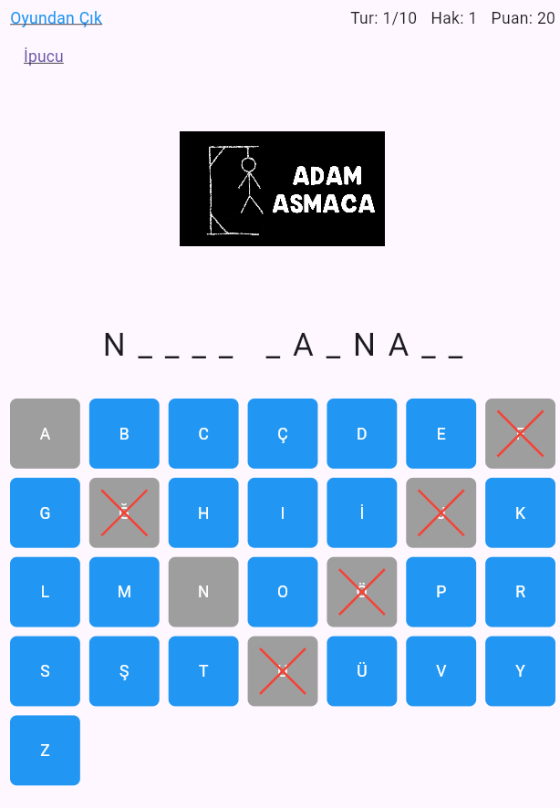
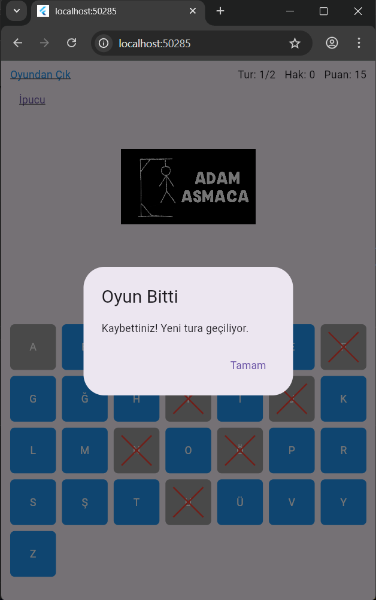
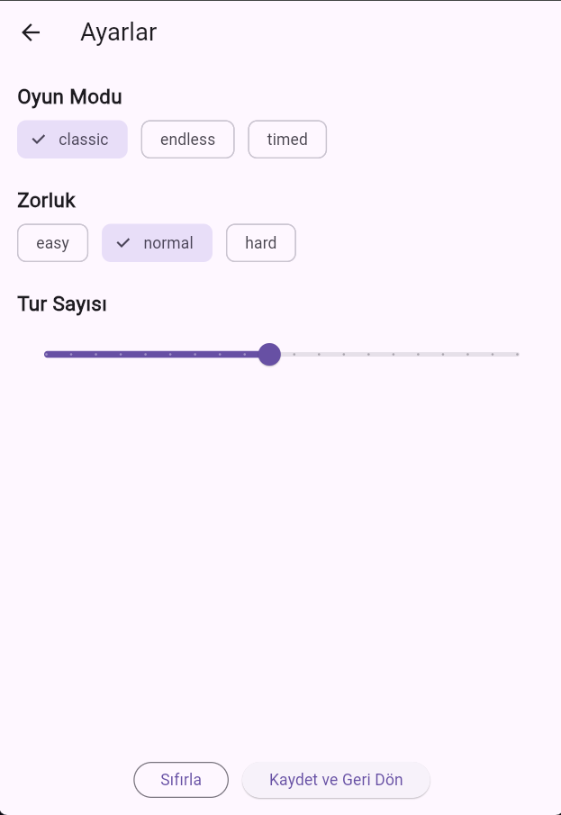

# Flutter Hangman 

A movie-themed Hangman game built with **Flutter**, featuring multiple game modes, adjustable difficulty levels, and timed challenges. Words are fetched dynamically via API, and the game keeps track of rounds, scores, and hints.

##  Screenshots

<div align="center">
  
  
  
</div>

##  Features

- **Multiple Game Modes** – Classic and Timed modes for varied gameplay
- **Difficulty Levels** – Adjustable lives and round time to match your skill
- **Movie-based Words** – Dynamically fetched movie titles via API
- **Hint System** – Get helpful clues about the movie when stuck
- **Round Tracking** – Monitor total rounds, current round, and score
- **Responsive UI** – Optimized for different screen sizes and orientations

##  Technologies Used

- **Flutter** – Cross-platform mobile framework
- **Dart** – Programming language
- **Provider** – State management solution
- **Dio** – HTTP client for API requests
- **TMDB API** – Movie database for fetching titles
- **Custom Widgets** – Modular game logic and UI components

##  Installation & Setup

### Prerequisites

- Flutter SDK (3.0 or higher)
- Dart SDK (3.0 or higher)
- Android Studio / Xcode (for mobile development)
- TMDB API key ([Get one here](https://www.themoviedb.org/settings/api))

### 1. Clone the repository

```bash
git clone https://github.com/sebahattinn/Flutter_Hangman.git
cd Flutter_Hangman
```

### 2. Install dependencies

```bash
flutter pub get
```

### 3. Configure environment variables

Create a `.env` file in the project root and add your API key:

```env
API_KEY=your_tmdb_api_key_here
```

> **Note:** The `.env` file is excluded from version control via `.gitignore`

### 4. Run the app

```bash
# For debug mode
flutter run

# For release mode
flutter run --release
```

##  Project Structure

```
lib/
├── controller/           # Game logic and settings controllers
│   ├── game_controller.dart
│   └── settings_controller.dart
├── services/            # API service and data fetching
│   └── api_service.dart
├── widgets/             # Reusable UI components
│   ├── hangman_display.dart
│   ├── letter_grid.dart
│   └── score_board.dart
├── screens/             # App screens
│   ├── game_screen.dart
│   ├── settings_screen.dart
│   └── result_screen.dart
└── main.dart           # Application entry point

assets/
├── images/             # Game images and icons
├── game_page.png
├── lose_page.png
└── settings_page.png

.env                    # Environment variables (not tracked)
pubspec.yaml           # Project dependencies
```

##  How to Play

1. **Choose a game mode** – Select between Classic or Timed mode
2. **Set difficulty** – Adjust the number of lives and time limit
3. **Start guessing** – Tap letters to reveal the movie title
4. **Use hints wisely** – Get clues when you're stuck (limited per game)
5. **Complete rounds** – Try to guess as many movies as possible
6. **Track your score** – Compete with yourself or friends

##  Contributing

Contributions are welcome! Please follow these steps:

1. Fork the repository
2. Create a feature branch (`git checkout -b feature/AmazingFeature`)
3. Commit your changes (`git commit -m 'Add some AmazingFeature'`)
4. Push to the branch (`git push origin feature/AmazingFeature`)
5. Open a Pull Request

##  License

This project is licensed under the MIT License – see the [LICENSE](LICENSE) file for details.

##  Author

**Sebahattin**
- GitHub: [@sebahattinn](https://github.com/sebahattinn)

##  Acknowledgments

- Flutter team for the amazing framework
- TMDB for providing the movie database API
- All contributors and testers

---

<div align="center">
  Made with ❤️ using Flutter
</div>
